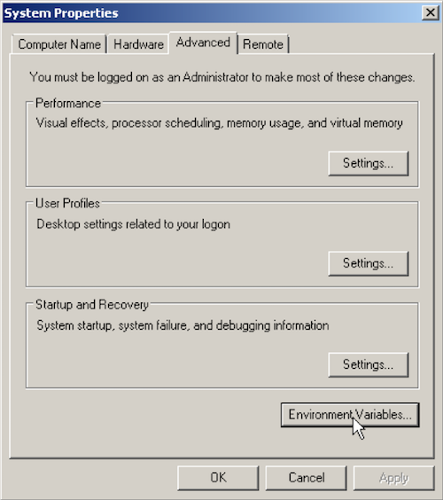

#Set-up Instructions
---
This library was designed for use in schools - it therefore doesn't require *installation*.  
Instead, it just needs to be [DOWNLOADED](https://github.com/RWBA/appJar/blob/appJar/releases/appJar.zip?raw=true) and unzipped somewhere accessible by the relevant users.  

##Single-user Set-up  
If you're just programming on your own PC, copy the **appJar folder** into your **code folder**, and you're done!  
(As long as it's in the same folder as your code, it'll work...)  

##Multi-user Set-up  
If you're in a school, this will still work, but there are alternatives...  
(Or, to make it accessible from any folder at home)  

* Create a folder on a shared network drive: `E:\PYLIB`, that all pupils can see  
* Put the **appJar folder** in there, and you're done!  

Just include the following at the top of every GUI program:  

```python
# add the appJar folder to your PATH
import sys
sys.path.append("E:\PYLIB")
```

##(not so) Advanced Set-up  
If you've got friendly technicians, or are at home, you can make this even more accessible...  

###Windows
----
Create an environment variable, which will mean `E:\PYLIB` is always in your **path**.  
Then you don't even need the two lines above to make it work...  

* Open **Control Panel**
* Navigate to **System -> Advanced System Settings**

* Click the **Advanced** tab

* Under **System variables**, click the **New..** button

* Set the **Variable name:** to be **PYTHONPATH**
* Set the **Variable value:** as the folder you put **appJar** in (eg. "E:\PYLIB")

* Press **OK**, and you're done!  

###Linux (Raspberry Pi)  
----
Linux requires command line access:  

* Launch a **Terminal**  
* Type the following:  
```bash
    echo 'export PYTHONPATH="${PYTHONPATH}:~/Documents/PYLIB"' >> ~/.bashrc
```
* Close the terminal, and you're done!  

###MAC OS  
----
If you're just running python from a Terminal, then you can follow the Linux instructions above.  

However, that won't work if you're running Python in a Desktop app, like IDLE.  
In this case, you'll need to add appJar to your **site-packages**.  

* Launch a **Terminal**  
* Type the following:  
```bash
mkdir -p ~/Library/Python/3.4/lib/python/site-packages
cd ~/Library/Python/3.4/lib/python/site-packages
echo '~/Documents/PYLIB' > appJar.pth
```
* Close the terminal, and you're done!  

**NB.** you'll need to make sure the version number (3.4) is correct.  

* To check your version, run this in Python:  
```python
import sys
print(sys.version) 
```
