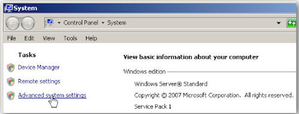
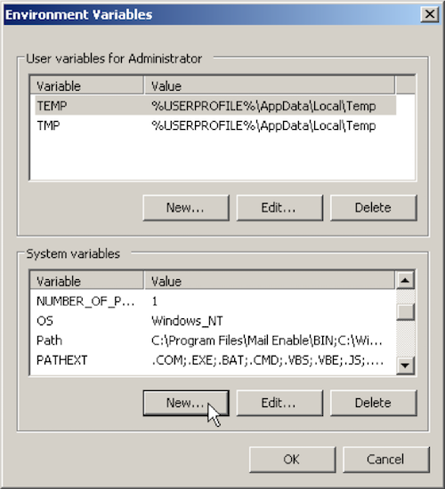

#Installation Instructions
---
This library is designed to be as simple as possible to *install*.  
As long as the `appJar` folder is in Python's path, you are good to go.  
###Preparing the library
----
All installations start the same:

* [Download](https://github.com/RWBA/rwbatools/blob/master/releases/rwbatools.zip?raw=true) the ZIP file.
* Unzip it.
* Make sure the folder is called ```appJar```  
* Put the folder in a sensible place ```~/Documents/PYLIB/```

Now, it's ready to go, at the top of your code, you can include the following:

```python
# add the appJar folder to your PATH
import sys
sys.path.append("~/Documents/PYLIB") # replce this with the correct path
# import the library
from appJar import gui
```

If you want a more permanent solution, you can add the above folder to your path. See below. 

###Windows Installation
----
* Open **Control Panel**
* Navigate to **System -> Advanced System Settings**

* Click the **Advanced** tab

* Under **System vartiables**, click the **New..** button

* Set the **Variable name:** to be **PYTHONPATH**
* Set the **Path:** as the folder you put **appJar** in (eg. c:\COMPUTINC\PYLIB")

* Press **OK**, and you're ready to go:

###Linux Installation
----
* Launch a **Terminal**
* Type the following:
```bash
    echo 'export PYTHONPATH="${PYTHONPATH}:~Documents/PYLIB"' >> ~/.bashrc
```
* Close the terminal, and you're ready to go

###MAC Installation
----
* It's a little trickier on MAC
* First off, run the Linux installation above. That will make it available form the command line.
* In OSX<=10.9:
    * Edit the ```/etc/launchd.conf``` file
    * Add the line: ``` setenv PYTHONPATH /Users/myname/Documents/PYLIB ```
    * And you're done

###Using the library
----
If the appJar folder is in your path, you can access it simply though an import:
```python
# import the library
from appJar import gui
```
