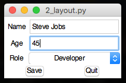

#Arranging Widgets
---

###Sequential programming
---
By default, each new widget is simply added on a new line. That way, you can very quickly, create a simple GUI:

```python
from rwbatools import gui  

def changeLabel(btn):  
    app.setLabel("l2", app.getEntry("text"))  

app = gui()  
app.addLabel("l1", "Simple Demo")
app.addEntry("text")
app.addButton("OK", changeLabel)
app.addEmptyLabel("l2")
app.go()
```


###Grid Layout
---
If, however, you want more than that, then a basic GRID layout is supported.

Each time you add a widget, you can specify a column, row, and even a column-span to position it in.

```python
from rwbatools import gui

def press(btn):
    if btn=="Save":
        n=app.getEntry("name")
        a=app.getEntry("age")
        r=app.getOptionBox("role")
        app.infoBox("Details", "You entered: {}, {}, {}".format(n, str(a), r))
    elif btn=="Quit":
        app.stop()

app=gui()

app.addLabel("l1", "Name", 0, 0)
app.addLabel("l2", "Age", 1, 0)
app.addLabel("l3", "Role", 2, 0)

app.addEntry("name", 0, 1)
app.addNumericEntry("age", 1, 1)
app.addOptionBox("role", ["Teacher", "Student", "Developer", "Volunteer"], 2, 1)

app.addButtons(["Save", "Quit"], press, 3, 0, 2)

app.go()
```

