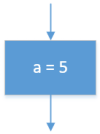
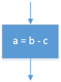
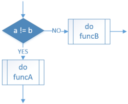
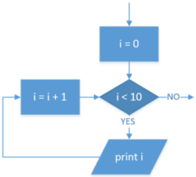
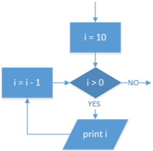

#Algorithms  
----  
Below are some helpful comparisons between different ways of acheiving the same result, starting from design, move on to high-level language, into low-level language and finally machine code.  

This guide was originally intended to help with LMC implementation, but is also useful for general python deisgn/coding.  

##Comparison  
Topic | FlowChart | PseudoCode | Python | Assembler | Machine Code
- | - | - | - | - | -
Assigning a variable |  | a &#8592; 5 | a=5 | a DAT 5 | 
Input |  | a &#8592; USERINPUT | a=input() | INP STA a | 901 3xx
Output |  | a &#8592; 5 | a=5 | LDA a OUT  | 5xx 902 
Subtraction |  | a &#8592; b - c | a=b-c | LDA b SUB c STA a | 5xx 2xx 3xx
Selection: Greater than |  | IF a &gt; b THEN &emsp;funcA() ELSE &emsp;funcB() ENDIF | a &gt; b: &emsp;funcA() else: &emsp;funcB() | LDA b SUB a BRP funcA BRA funB | 5xx 2xx 8xx 6xx 
Selection: Less than |  | IF a &lt; b THEN &emsp;funcA() ELSE &emsp;funcB() ENDIF | a &lt; b: &emsp;funcA() else: &emsp;funcB() | LDA a SUB b BRP funcB BRA funcA | 5xx 2xx 8xx 6xx
Selection: Equal to |  | IF a = b THEN &emsp;funcA() ELSE &emsp;funcB() ENDIF | if a == b: &emsp;funcA() else: &emsp;funcB() | LDA a SUB b BRZ funcA BRA funcB | 5xx 2xx 7xx 6xx
Selection: Not equal to |  | IF a &#8800; b THEN &emsp;funcA() ELSE &emsp;funcB() ENDIF | if a &#8800; b: &emsp;funcA() else: &emsp;funcB() | LDA a SUB b BRZ funcB BRA funcA | 5xx 2xx 7xx 6xx
Iteration: While loop |  | WHILE a &#8800; b &emsp;OUTPUT b &emsp;a &#8592; USERINPUT ENDWHILE | while a != b: &emsp;print(b) &emsp;a = input() | while LDA a &emsp;&emsp;SUB b &emsp;&emsp;BRZ endwhile &emsp;&emsp;LDA b &emsp;&emsp;OUT &emsp;&emsp;INPU &emsp;&emsp;STA a &emsp;&emsp;BRA while endwhile HLT a DAT 0 b DAT 5| 5xx 2xx 7xx 5xx 902 901 3xx 6xx 000
Iteration: For loop (count-up) |  | FOR i &#8592; 0 TO 9 &emsp;OUTPUT i ENDFOR | for i in range(10): &emsp;print(i) | for LDA i &emsp;&emsp;OUT &emsp;&emsp;ADD one &emsp;&emsp;STA i &emsp;&emsp;SUB ten &emsp;&emsp;BRZ endfor &emsp;&emsp;BRA for endfor HLT i DAT 0 one DAT 1 ten DAT 10 | 5xx 902 1xx 3xx 2xx 7xx 6xx 000
Iteration: For loop (count-down) |  | FOR 1 &#8592; 10 TO 1 &emsp;OUTPUT i ENDFOR | for i in range(10, 0, -1): &emsp;print(i) | for LDA i &emsp;&emsp;OUT &emsp;&emsp;SUB one &emsp;&emsp;STA i &emsp;&emsp;BRZ endfor &emsp;&emsp;BRA for endfor HLT 1 DAT 10 one DAT 1 | 5xx 902 2xx 3xx 7xx 6xx 000

##Links  
1. [Online LMC](http://www.gcsecomputing.org.uk/lmc/index.html)
2. [LMC Explanation](http://www.yorku.ca/sychen/research/LMC/)
3. [PseudoCode CheatSheet](/cheatSheets/PseudoCode%20CheatSheet.pdf)
4. [PseudoWars](http://pseudowar.appjar.info)
5. [AQA PseudoCode Guidelines](http://filestore.aqa.org.uk/subjects/AQA-GCSE-COMPSCI-W-TRB-PSEU.PDF)

##LMC Instructions  
Instructions | Mneumonic | Machine Code | Explanation
- | - | - | - 
Add | **ADD** | 1xx | Adds the contents of memory xx to the **ACCUMULATOR**.
Subtract | **SUB** | 2xx | Subtracts the contents of memory xx from the **ACCUMULATOR**.
Store | **STA** | 3xx | Copies the contents of the **ACCUMULATOR** to memory xx.
Load | **LDA** | 5xx | Copies the contents of memory xx to the **ACCUMULATOR**.
Branch ALWAYS | **BRA** | 6xx | Always set the program counter to xx. The program continues from the instruction at memory xx.
Branch if ZERO | **BRZ** | 7xx | Set the program counter to xx only of the **ACCUMULATOR** is zero.
Branch if POSITIVE | **BRP** | 8xx | Set the program counter to xx only if the **ACCUMULATOR** is zero or positive (greater than zero).
Input | **INP** | 901 | Copy the contents of the **INBOX** to the **ACCUMULATOR**.
Output | **OUT** | 902 | Copy the contents of the **ACCUMULATOR** to the **OUTBOX**.
Define Variable | **DAT** | | Reserves this memory slot as a variable, settinmg its contents to the value specified.
Halt | **HLT** | 000 | Halts execution of the program.
