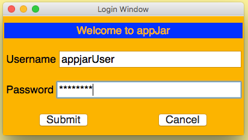

# appJar  
*The easiest way to create GUIs in Python.*  

---

Written by a teacher, in the classroom, for students.  

**appJar** is designed to run on as many versions of [Python](https://www.python.org/downloads/) as possible - so it should work in your school.  

There are no other dependencies - simply [download](https://github.com/RWBA/appJar/blob/appJar/releases/appJar.zip?raw=true), unzip, and put it in your code folder.  
Check out the [installation](/Install) instructions for other ways to get **appJar** working.  

GUIs in Python are hard, there's a huge amount of [boilerplate code](https://en.wikipedia.org/wiki/Boilerplate_code) required to get things working - so we hide all of that.  
We're also not big fans of lots of parameters, so we keep them to a minimum, instead giving functions to get & set most things.  

### Hello appJar  
---

[GUIs](https://en.wikipedia.org/wiki/Graphical_user_interface) in **appJar** require three steps.  

* First, import the library & create a GUI variable.  
    (from now on, we do everything to the GUI variable)  

```python
# import the library
from appJar import gui
# create a GUI variable called app
app = gui()
```

* Then, using the gui variable, add and configure some widgets:  
    (if you've tried [turtle](https://docs.python.org/3.6/library/turtle.html) this will all look very familiar)  

```python
# add & configure widgets - widgets get a name, to help referencing them later
app.addLabel("title", "Welcome to appJar")
app.setLabelBg("title", "red")
```

* Finally, start the GUI:  
    (**NB.** don't put any code after this line)  

```python
# start the GUI
app.go()
```

* And, that's it: 

      

### Interactivity    
---
Of course, the whole point of making a GUI, is to be interactive - this requires **events**.  

The idea behind [event-driven programming](https://en.wikipedia.org/wiki/Event-driven_programming) is that each time the user clicks, presses or drags something (an event) the GUI should respond.  

* First, add some more widgets ([Entry Boxes](/pythonWidgets/#entry)), for the user to interact with:

```python
app.addLabelEntry("Username")
app.addLabelSecretEntry("Password")
```

* Then, we'll need a **function** - a block of code to call, when an event happens:  

```python
def press(button):
    if button == "Cancel":
        app.stop()
    else:
        usr = app.getEntry("Username")
        pwd = app.getEntry("Password")
        print("User:", usr, "Pass:", pwd)
```


* Finally, some widgets ([buttons](/pythonWidgets/#button)) to create the events:  

```python
# link the buttons to the function called press
app.addButtons(["Submit", "Cancel"], press)
```

* We now have an interactive GUI:  

    

When the user presses a button, the `press` function is called, passing the name of the button as a parameter.  

### Appearance counts
---
As well as changing widgets, you can also change the way the [GUI looks](/pythonGuiOptions):  

* For starters, you can specify a name and size for your GUI, when you create the variable:  

```python
app = gui("Login Window", "400x200")
```

* As well as changing widget appearance, you can also change the general GUI's appearance:  

```python
app.setBg("orange")
app.setFont(18)
```

* You can even specify where you want the cursor to be when the GUI starts:  

```python
app.setFocus("Username")
```

* It now looks a bit better:  

      

    (**NB.** We also set some other colours on the label - see [below](#full-code-listing)) 

###  Make your own  
---
<script async src="//pagead2.googlesyndication.com/pagead/js/adsbygoogle.js"></script>
<ins class="adsbygoogle"
    style="display:block"
    data-ad-format="fluid"
    data-ad-layout-key="-gw-13-4l+6+pt"
    data-ad-client="ca-pub-6185596049817878"
    data-ad-slot="5627392164"></ins>
<script>(adsbygoogle = window.adsbygoogle || []).push({});</script>
---  

And, that's all you need to know. Check out:  

* All the different [widgets](/pythonWidgets) available.  
* Our support for [images](/pythonImages) and [sound](pythonSound).  
* How to include [toolbars, menubars & statusbars](/pythonBars).  
* How to create simple [pop-ups](/pythonDialogs).  
* How to use a [grid layout](/pythonWidgetLayout).  
* How to use [containers](/pythonWidgetGrouping) for more advanced layouts.  

### Full code-listing  
---  

Below is the full code-listing created on this page:  

```python
# import the library
from appJar import gui

# handle button events
def press(button):
    if button == "Cancel":
        app.stop()
    else:
        usr = app.getEntry("Username")
        pwd = app.getEntry("Password")
        print("User:", usr, "Pass:", pwd)

# create a GUI variable called app
app = gui("Login Window", "400x200")
app.setBg("orange")
app.setFont(18)

# add & configure widgets - widgets get a name, to help referencing them later
app.addLabel("title", "Welcome to appJar")
app.setLabelBg("title", "blue")
app.setLabelFg("title", "orange")

app.addLabelEntry("Username")
app.addLabelSecretEntry("Password")

# link the buttons to the function called press
app.addButtons(["Submit", "Cancel"], press)

app.setFocus("Username")

# start the GUI
app.go()
```
