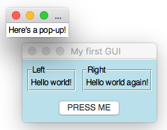

The Power of **with**
--

One thing I really wanted to get into appJar, was some indentation - I wanted the code for the GUI to look more like the actual GUI.  

I also wanted to simplify the creation of containers and even the GUI itself.  

So, now you can!  
(**NB.** this is a new feature, so you migth find some issues...)  

```python
with gui("My first GUI") as app:
    app.addLabel("lab", "Hello world!")
```

That's it - 2 lines to create a GUI.  

If you want to add containers, it's the same process:


```python
from appJar import gui
with gui("My first GUI") as app:
    app.setBg("lightblue")

    with app.labelFrame("Left"):
        app.addLabel("left", "Hello world!")

    with app.labelFrame("Right", row=0, column=1):
        app.addLabel("right", "Hello world again!")

    app.addNamedButton("PRESS ME", "Pop-up", app.showSubWindow, colspan=2)

    with app.subWindow("Pop-up"):
        app.addLabel("popLab", "Here's a pop-up!")
```

And, that's all there is to it.  
This feature is available on all containers, and I think is going to make life a lot easier!

The old start/stop functions all still exist, so there is no need to use the `with` command. But if you prefer this method you can.  

An added bonus, is that the same syntax works for starting a container or opening a container!
