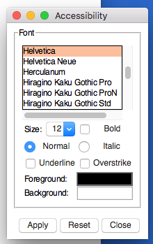
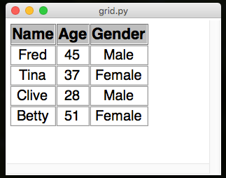
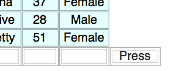
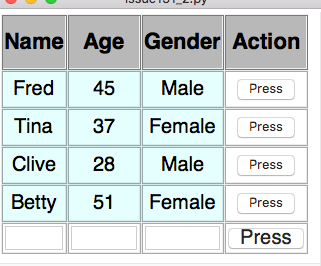
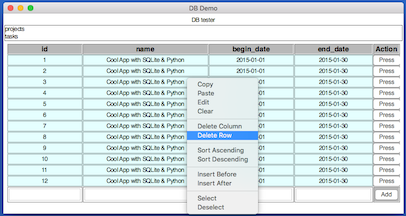

#Beta Widgets  
----
The following widgets are in [beta](https://en.wikipedia.org/wiki/Software_release_life_cycle#BETA) - they're available and being used, they're just not quite finished...  

## Accessibility
---

A pop-up to configure GUI settings.  



```python
from appJar import gui

with gui("Demo Access") as app:
    app.button('Accessibility', app.showAccess, icon='ACCESS')
```

It allows you to configure:  
* Font Family
* Font Size
* Bold True/False
* Normal/Italic
* Underline True/False
* Overstrike True/False
* Foreground Colour
* Background Colour

## Table
---
Used to create a spreadsheet like interface.  
The Table has mouse interactivity, with mouse-over highlighting, and mouse-click highlighting.  
It is possible to include buttons at the end of each row, and an additional row of entry boxes, with their own button.  

  

```python
from appJar import gui

app = gui()
app.setFont(20)
app.addTable("g1",
    [["Name", "Age", "Gender"],
    ["Fred", 45, "Male"],
    ["Tina", 37, "Female"],
    ["Clive", 28, "Male"],
    ["Betty", 51, "Female"]])
app.go()
```

#### Add Tables  

* `.addTable(title, data, action=None, addRow=None)`  
    Receives a (jagged) 2D list of values. The first list should be the headers for the Table, the rest will contain each row of values.  

    If `action` is set, a button will be created, at the end of each row, calling the specified function. It will pass the row number (starting at 0).  

       

    If `addRow` is set, then an additional row will appear at the end of the Table, with entry boxes and a button to call the specified function.  
    The button will pass the string `newRow` to the specified function.  

       

    If both parameters are set to a function, then both buttons at the end of each row and a row of Entry boxes will be shown:  

       

    It's also possible to set the following parameters:  
        * `actionHeading` - set the title of the right column  
        * `actionButton` - set the button text for each row  
        * `addButton` - set the button text for the Entry row  
        * `showMenu` - boolean to show a right-click menu  
        * `disabledEntries` - pass a list of numbers, to disable entry boxes in those positions  
        * `border` - the style of the cell border: `sunken`, `solid`, etc

       

#### Connecting to Databases

* `.addDbTable(title, db, table)`  
    Will connect to the specified database, and show all rows in the specified table.  
    appJar will query the table to detect the PrimaryKey, and use this as the key when selecting the row.

* `.replaceDBTable(title, db, table)`  
    Will replace the currently shown data in the Table, with the data found in the specified database/table.  

* `.refreshDBTable(title)`  
    Will refresh the specified DB Table.  

* `.addDbOptionBox(title, db, change=None)`  
    Will create an OptionBox, containing a list of all the tables available in the specified database.  

* `.refreshDbOptionBox(title)`  
    Will reload the list of tables displayed in the specified DB OptionBox.  

#### Get Tables  

* `.getTableRow(title, rowNumber)`  
    Returns a list of values representing the specified row.  

* `.getTableRowCount(title)`  
    Returns a count of how many rows are in the Table (not including the header row).  

* `.getTableSelectedCells(title)`  
    Gets a dictionary of booleans, indicating the status of each cell.  
    True indicates the cell is selected, False indicates the cell is not selected.  
    The name of each entry on the dictionary will be in the format ROW-COLUMN, eg. 0-2  

* `.getTableEntries(title)`  
    If `addRow` was set when the *Table* was created, this function will get the contents of the entry boxes.  
    They will be returned as a list, in the same order as the entry boxes.  

#### Set Tables  

* `.addTableRow(title, data)`  
    Adds a new row of data to the end of the existing Table.  
    It will be positioned at the bottom of the Table, above the entry boxes if present.  

To have the **Press** button on the entries row add a new row of data, try the following:  
```python
    def press(btn):
        if btn == "addRow":     # the button on the entries row
            data = app.getTableEntries("g1")
            app.addTableRow("g1", data)
``` 

* `.addTableRows(title, data)`  
    Adds the new rows of data to the end of the existing Table.  

* `.replaceTableRow(title, rowNum, data)`  
    Replace the values in the specified row with the new data.  
    If the new data has fewer items, the remaining cells will be emptied.  

* `.replaceAllTableRows(title, rowNum, data)`  
    Removes all existing rows, before adding the new rows.  

* `.setTableHeaders(title, data)`  
    Replace the values in the header row.  
    If the new data has fewer items, the remaining header cells will be emptied.  

* `.deleteTableRow(title, rowNum)`  
    Delete the specified row from the specified Table.

* `.deleteAllTableRows(title)`  
    Delete all rows from the specified Table (except the header row).  

* `.addTableColumn(title, columnNumber, data)`  
    Add the column of data to the named Table, in the specified position.  

* `.deleteTableColumn(title, columnNumber)`  
    Delete the specified column from the named Table.  
    
* `.selectTableRow(title, row, highlight=None)` & `.selectTableColumn(title, col, highlight=None)`  
    These will either select or highlight the specified row or column in the named Table.  
    If you leave `highlight=None` the row/column will be toggled between selected & deselected.  
    If you set `highlight=True` the row/column will be highlighted (like a mouse over). 
    If you set `highlight=False` the row/column will be un-highlighted (like a mouse over). 

* `.disableTableEntry(title, entryPos, disabled=True)`  
    Will disable the specified entry box (starting at 0) if entries are being displayed.  

## Tree
---
Takes an arbitrary XML string, and converts it into a tree structure.  


```python
from appJar import gui

app = gui()
app.addTree("t1",
            """<people>
            <person><name>Fred</name><age>45</age><gender>Male</gender></person>
            <person><name>Tina</name><age>37</age><gender>Female</gender></person>
            <person><name>CLive</name><age>28</age><gender>Male</gender></person>
            <person><name>Betty</name><age>51</age><gender>Female</gender></person>
            </people>""")
app.go()
```

#### Add Trees
* `.addTree(title, xml_data)`  
    Create a tree from the specified XML data  

#### Set Trees
* `.setTreeDoubleClickFunction(title, func)`  
    Register a function to call when an item is double-clicked  
* `.setTreeEditFunction(title, func)`  
    Register a function to call when an item is edited  
* `.setTreeEditable(title, value)`  
    Set whether the tree can be edited  
* `.setTreeColours(title, fg, bg, fgH, bgH)`  
    Set the fg/bg/fg highlight/bg highlight colours of the tree  
* `.setTreeBg(title, colour)`  
    Set the background colour of the tree  
* `.setTreeFg(title, colour)`  
    Set the foreground colour of the tree  
* `.setTreeHighlightBg(title, colour)`  
    Set the background colour of the highlighted node    
* `.setTreeHighlightFg(title, colour)`  
    Set the foreground colour of the highlighted node  

#### Get Trees  
* `.getTreeXML(title)`  
    Return the tree as XML  
* `.getTreeSelected(title)`  
    Return the selected node as a String
* `.getTreeSelectedXML(title)`  
    Return the selected node (and any children) as XML

