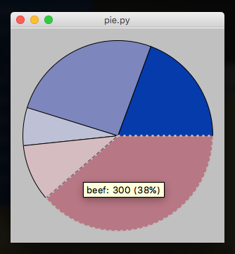
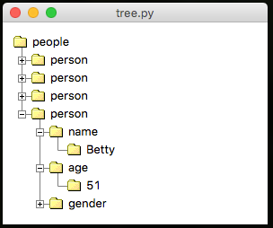

#Widgets Under Development
----
The following widgets are **under development**.  
They're included in the library, but offer limited functionality, and are still buggy.  

###PieChart
---
Widget to depict a Pie Chart.  
It will automatically calculate percentages, and draw a pie chart, given a dictionary of items and their amount.  
The PieChart is purely for display purposes, and is not interactive.  
  

```python
    from appJar import gui

    app=gui()
    app.addPieChart("p1", {"apples":50, "oranges":200, "grapes":75,
                            "beef":300, "turkey":150}, size=300)
    app.go()
```

####Add PieCharts  
* `.addPieChart(title, values, size=100)`  
    Takes a dictionary of names and values, which will be converted to percentages, and plotted on the chart.  
    The names will be used as part of tooltips that appear over each wedge of the PieChart.  
    An optional size parameter can be passed, to adjust the size of the PieChart.  

####Set PieCharts  
* `.setPieChart(title, name, value)`  
    Will update the PieChart, by either changing an existing value, adding a new value, or removing a value if it's set to 0.  

###Tree
---
Takes an arbitrary XML string, and converts it into a tree structure.  



```python
from appJar import gui

app=gui()
app.addTree("t1",
            """<people>
            <person><name>Fred</name><age>45</age><gender>Male</gender></person>
            <person><name>Tina</name><age>37</age><gender>Female</gender></person>
            <person><name>CLive</name><age>28</age><gender>Male</gender></person>
            <person><name>Betty</name><age>51</age><gender>Female</gender></person>
            </people>""")
app.go()
```

####Add Trees
* `.addTree(title, xml_data)`  
    Create a tree from the specified XML data  

####Set Trees
* `.setTreeDoubleClickFunction(title, func)`  
    Register a function to call when an item is double-clicked  
* `.setTreeEditFunction(title, func)`  
    Register a function to call when an item is edited  
* `.setTreeEditable(title, value)`  
    Set whether the tree can be edited  
* `.setTreeBg(title, colour)`  
    Set the background colour of the tree  
* `.setTreeFg(title, colour)`  
    Set the foreground colour of the tree  
* `.setTreeHighlightBg(title, colour)`  
    Set the background colour of the highlighted node    
* `.setTreeHighlightFg(title, colour)`  
    Set the foreground colour of the highlighted node  

####Get Trees  
* `.getTreeXML(title)`  
    Return the tree as XML  
* `.getTreeSelected(title)`  
    Return the selected node as a String
* `.getTreeSelectedXML(title)`  
    Return the selected node (and any children) as XML


###Grid
---
Used to create a spreadsheet like interface.  
The grid has mouse interactivity, with mouse-over highlighting, and mouse-click highlighting.  
It is possible to include buttons at the end of each row, and an additional row of entry boxes, with their own button.  

  

```python
    from appJar import gui

    app=gui()
    app.setFont(20)
    app.addGrid("g1",
        [["Name", "Age", "Gender"],
        ["Fred", 45, "Male"],
        ["Tina", 37, "Female"],
        ["Clive", 28, "Male"],
        ["Betty", 51, "Female"]])
    app.go()
```

####Add Grids  

* `.addGrid(title, data, action=None, addRow=False)`  
    Receives a (jagged) 2D list of values. The first list should be the headers for the grid, the rest will contain each row of values.  
    If action is set, a button will be created, at the end of each row,  calling the specified function.  
    If addRow is True, then an additional row will appear at the end, with entry boxes and an additional button.  

####Get Grids  
* `.getGridEntries(title)`  
    Get the contents of the entry boxes, if present.  
    Returned as a list, in the same order as the entry boxes.  
* `.getGridSelectedCells(title)`  
    Gets a dictionary of booleans, indicating the status of each cell.  
    True indicates the cell is selected, False indicates the cell is not selected.  
    The name of each entry on the dictionary will be in the format ROW-COLUMN, eg. 0-2  

####Set Grids  

* `.addGridRow(title, data)`  
    Add a single row of data to the existing grid.  
    It will be positioned at the bottom of the grid, above the entry boxes if present.  

###Meters
---
Working on some different styles for the Meter.  
And, a better look - gradated colour...  
####SplitMeter
Shows two values, left & right  


####DualMeter
Shows percentage left & right  

###DatePicker
---
A widget to capture a date - will handle presenting accurate drop-downs, and return a date.  
  

```python
from appJar import gui

def showDate(btn):
    print(app.getDatePicker("dp"))

app=gui()
app.addDatePicker("dp")
app.addButton("GET", showDate)
app.setDatePickerRange("dp", 1900, 2100)
app.setDatePicker("dp")
app.go()
```
####Add DatePickers  

* `.addDatePicker(title)`  
    Create a DatePicker, with a range from 1/1/1970 to 31/12/2020  

####Set DatePickers  

* `.setDatePicker(title, date=None)`  
    Will set the specified DatePicker to the specified date, or current date if no date is supplied.  

* `.setDatePickerRange(title, startYear, endYear=None)`  
    Set the range for the named DatePicker.  
    If endYear is None, the current Year will be used.  

####Get DatePickers  

* `.getDatePicker(title)`  
    Will return the currently selected date.  

