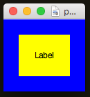
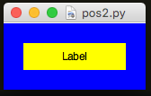
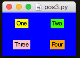
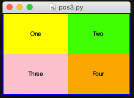

#GUI Options
---
There are a number of generic configurations available, which will affect the whole GUI.  
Some of these are also available at a widget level, where you can specify individual configurations tor specified widgets.  

##GUI Configuration
---

Some basic configuration for the size, position, transparency, etc. of the GUI.

###Look & Feel  
* `.setTitle(title)`  
    Sets the title of the GUI. By default, it is the name of the script.

* `.setIcon(fileName)`  
    Sets an icon for the GUI.

* `.setTransparency(percentage)`  
    Sets how transparent the GUI is. Between 0 and 100%.

###Size & Locaiton

* `.setGeometry(geom)` & `.setGeometry(width, height)`  
    Sets the height & width of the GUI:  
    * Either as a single String `.setGeometry("200x100")` (widthxheight)  
    * As two seperate parameters `.setGeometry(200,100)`
    * Or to go *Fullscreen* `.setGeometry("Fullscreen")`  

* `.exitFullscreen()`  
    Leave fullscreen, if set in the geometry.    
    `<Escape>` will call this automatically, while in fullscreen.  

* `.setResizable(canResize=True)`  
    Sets whether the GUI can be resized or not.  

* `.setLocation(x, y)`  
    Sets the position of the GUI.  

* `.setPadding(x, y)`  
    Sets the size of the border inside the GUI - defaults to 2.  

* `.hideTitleBar()` & `.showTitleBar()`  
    Hides/shows the GUI's title bar.  
    Note, if the title bar is removed, it's not possible to move or resize the GUI.  

##GUI Design
----
It's possible to change the default colours and fonts for widgets in the GUI.

###Colour

* `.setBg(colour)`  
    Set the background colour for the entire GUI. This should affect all widgets, and will override any backgrounds set before.

###Font
* `.setFont(size, font=None)`  
    This can be used to set the font size and style for all widgets.

* `.decreaseFont()` & `.increaseFont()`  
    These can be used to increase or decrease the font of all widgets.

* `.setLabelFont(size, family=None)`  
    This can be used to set the font size and style for all label-type widgets.

* `.increaseLabelFont()` & `.decreaseLabelFont()`  
    These can be used to increase or decrease the font of all label-type widgets.

* `.setButtonFont()`  
    This can be used to set the font size and style for all button-type widgets.

* `.increaseButtonFont()` & `.decreaseButtonFont()`  
    These can be used to increase or decrease the font of all butotn-type widgets.

## Widget Padding & Positioning
----

The below commands allow the user to change how appJar lays out widgets on the screen.  
These settings will be applied to all widgets within the current container.  

###Widget Padding
Padding is empty space around the edges of a widget.  


```python
app.setPadX(20) # padding outside the widget
app.setPadY(20)
app.setIPadX(20) # padding inside the widget
app.setIPadY(20)
```
####Set Padding
* `.setPadX()` & `.setPadY()`  
    These set how much empty space is included, outside a widget, between the widget & the cell's edge.  

* `.setIPadX()` & `.setIPadY()`  
    These set how much empty space is included, inside a widget, between the text and the widget's border.  


```python
app.setPadX(20) # padding outside the widget
app.setPadY(20)
app.setIPadX(40) # padding inside the widget
app.setIPadY(5)
```

###Widget Positioning
There are two aspects to how widgets are positioned:  

* How columns and rows expand to fill the GUI space.  
* How widgets expand to fill their cells.  

By default, columns will expand (equally) to fill the width of the GUI, but rows will not.  
Within their cells, widgets will *stick* to the `east` & `west` sides (left & right) but not the `north` & `south` (top  & bottom).  
  

It's possible to tell a widget to not stick to the sides of its cell:  

  
```python
app.setSticky("")
```  

Or, to tell it to stick to all sides:  
  
```python
app.setSticky("nesw")
```  

However, even though the widget is sticking to all sides of the cell.  
You still have to tell the rows to expand to fill the GUI space:  

  

```python
app.setExpand("both")
app.setSticky("nesw")
```  

####Set Sticky & Expand

* `.setSticky(sides)`  
    This determines which sides of the grid-cell the widget will stick to.  
    It should be a string, made up of any combination of `n`, `e`, `s` or `w`  
    By default, most widgets use `"ew"`  

* `.setExpand()`  
    This tells rows & columns what to do when the GUI is resized.  
    It allows them to adjust to fill the available space:
    * `none` - don't expand  
    * `row` - expand with rows only  
    * `column` - expand with columns only  
    * `all` - expand in all directions  

It's even possible to give each widget its own *stickiness*:  
  
```python
from appJar import gui

app=gui()

app.setBg("blue")
app.setExpand("both")

app.setSticky("nw")
app.addLabel("l1", "One", 0, 0)
app.setLabelBg("l1", "yellow")

app.setSticky("ne")
app.addLabel("l2", "Two", 0, 1)
app.setLabelBg("l2", "green")

app.setSticky("sw")
app.addLabel("l3", "Three", 1, 0)
app.setLabelBg("l3", "pink")

app.setSticky("se")
app.addLabel("l4", "Four", 1, 1)
app.setLabelBg("l4", "Orange")

app.go()
```
