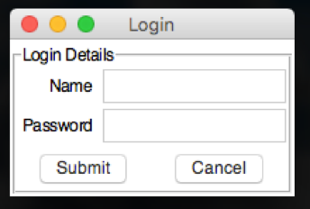
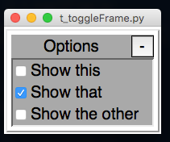
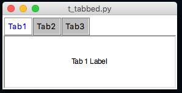
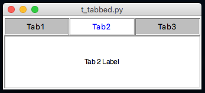
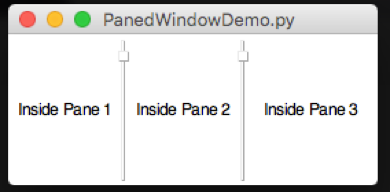
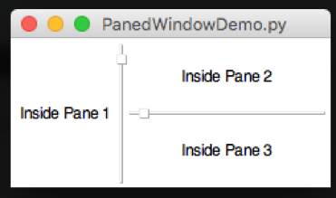
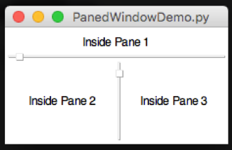
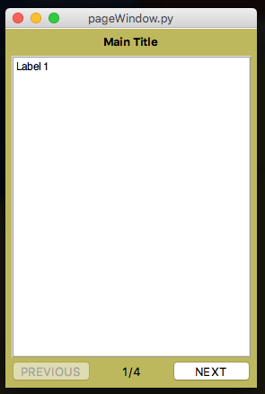

# Grouping Widgets  
----
The standard way of using *appJar*, is simply to place all widgets into a single window.  
Everything is grouped into that single window, and any changes affect everything in that window.  

It's sometimes desirable to group widgets together within a window.  
Or to have multiple *pages* of widgets.  
A number of options are provided to make this easier.  

### Format  
All of these methods work in the same way.  
You call the `start` function when you want to start a container, then the `stop` function when you're done.  
When you call `start` you can pass in positional arguments like any other widget (row, column, rowspan, colspan).  
Any [GUI Options](pythonGuiOptions) you set, within the container, will only affect that container.  

#### Reopening Containers  
If you want to dynamically add widgets to a container, once the gui has been started, you can open a specific container, perform the desired actions, then stop it again.
```python
def addRows(btn):
    count = app.getEntry("numRows")
    app.openTab("tabbedPane", "Details Tab") # open the required tab
    for rowLoop in range(count):
        # add a new label, with a unique ID
        # make sure to put it in the right place
        app.addLabel("dyn"+str(rowLoop), "Dynamic Label", rowLoop+5)
    app.stopTab()
```

### Label Frame
----
A way of grouping widgets into a box, with a label at the top of the box.  
Position the *LabelFrame* within the grid, then position widgets inside the *LabelFrame*  

**NB.** *LabelFrames* have a different [stickiness](/pythonWidgetLayout/#widget-positioning) to the *appJar* GUI - they only stick widgets to the `w` (left) side.  
If you want your widgets to stretch across the *LabelFrame*, like the rest of *appJar*, you will need to call `app.setSticky("ew")` after starting the *LabelFrame*.  


```python
from appJar import gui

app=gui()

app.startLabelFrame("Login Details")
# these only affect the labelFrame
app.setSticky("ew")
app.setFont(20)

app.addLabel("l1", "Name", 0, 0)
app.addEntry("Name", 0, 1)
app.addLabel("l2", "Password", 1, 0)
app.addEntry("Password", 1, 1)
app.addButtons(["Submit", "Cancel"], None, 2, 0, 2)
app.stopLabelFrame()

app.go()
```

#### Start/Stop Label Frames  
* `.startLabelFrame(name, hideTitle=False)` & `.stopLabelFrame()`  
    Used to start and stop a *LabelFrame*  
    The specified title will be used as the label for the frame.  
    Set hideTitle to be True if you don;t want to show a title.  

* `.openLabelFrame(title)`  
    Used to reopen the named *LabelFrame*.  

#### Set Label Frames  
* `.setLabelFrameTitle(name, newTitle)`  
    Used to change the label displayed in the *LabelFrame*.  

* `.setLabelFrameAnchor(name, position)`  
    Used to change the position of the label on the *LabelFrame*.  
    Use compass coordinates, eg. `"ne"` or `"sw"`.  

* `.setSticky(coords)`  
    By default, widgets in the frame will align on the left.  
    If you want to change this, specify a different `sticky` value.  
    For example, `.setSticky("ew")` will cause the widgets to stretch to fit the width, aligning in the centre.  

### Toggle Frame
----
A collapsible container for a group of related widgets.  
By default, the contents of the frame are hidden.  
They can be revealed/hidden again by clicking an associated button.  


```python
from appJar import gui

app=gui()
app.setFont(20)

app.startToggleFrame("Options")
app.addCheckBox("Show this")
app.addCheckBox("Show that")
app.addCheckBox("Show the other")
app.setCheckBox("Show that")
app.stopToggleFrame()

app.go()
```
#### Start/Stop Toggle Frames  
* `.startToggleFrame(title)` & `.stopToggleFrame(title)`  
    Used to start and stop a *ToggleFrame*.  
    The `title` will be used as the title for the *ToggleFrame*.  

* `.openToggleFrame(title)`  
    Used to reopen the named *ToggleFrame*.  
#### Set Toggle Frames  
* `.setToggleFrameText(title, newText)`  
    Will update the text displayed in the *ToggleFrame*.  

* `.toggleToggleFrame(title)`  
    Will toggle the state of the specified *ToggleFrame*.  

* `.disableToggleFrame(title, disabled=True)`  
    Will disable the specified *ToggleFrame*.  
    If `disabled` is set to False, the *ToggleFrame* will be re-enabled.  
#### Get Toggle Frames  
* `.getToggleFrameState(title)`  
    Will return True if the *ToggleFrame* is open, else will return False.  

### Tabbed Frame
---
A way to create a (basic) tabbed-style interface.  
Position the *TabbedFrame* within the grid, start a *Tab*, then position widgets inside the *Tab*  
  
```python
from appJar import gui

app=gui()

app.startTabbedFrame("TabbedFrame")
app.startTab("Tab1")
app.addLabel("l1", "Tab 1 Label")
app.stopTab()

app.startTab("Tab2")
app.addLabel("l2", "Tab 2 Label")
app.stopTab()

app.startTab("Tab3")
app.addLabel("l3", "Tab 3 Label")
app.stopTab()
app.stopTabbedFrame()

app.go()
```
#### Start/Stop Tabbed Frames
* `.startTabbedFrame(name)` & `.stopTabbedFrame()`  
    Used to start & stop the a *TabbedFrame*, with the specified name.  

* `.startTab(name)` & `.stopTab()`  
    Used to start and stop each of the tabs in the *TabbedFrame*.  
    The title for the tab will be the specified *name*.  

* `.openTabbedFrame(title)` & `.openTab(frameTitle, tabTitle)`  
    Used to reopen the named *TabbedFrame* or named *Tab*.  

#### Set TabbedFrame

* `.setTabText(title, tab, newText=None)`  
    Change the text of the named tab in the specified *TabbedFrame*.  
    If no `newText` is provided, the tab will revert back to its original text.  

* `.setTabbedFrameTabExpand(title, expand=True)`  
    By default, the tabs take up the minimum amount of space necessary.  
    Set this to True, to have the tabs fill the entire row.  
  

* `.setTabbedFrameSelectedTab(title, tab)`  
    Select the specified tab in the TabbedFrame.  

* `.setTabbedFrameDisabledTab(title, tab, disabled=True)`  
    Disable the specified tab in the TabbedFrame.  
    Set disabled to False to re-enable it.  
    This will also change the displayed tab, if the displayed tab is being disabled.  

* `.setTabbedFrameDisableAllTabs(title, disabled=True)`  
    Will disable all tabs for the named TabFrame.  
    Or, enable them if disabled is set to False.  

#### Changing Colours  
TabbedFrames have a set of colours that can be changed:  

* ActiveFg - Sets the colour of the text in the active tab  
* ActiveBg - Sets the background colour of the active tab  
* InactiveFg - Sets the colour of the text in all inactive tabs  
* InactiveBG - Sets the background colour of all inactive tabs  
* DisabledFg - Sets the colour of the text in all disabled tabs  
* DisabledBg - Sets the background colour of all disabled tabs  
* Bg - Sets the background colour behind the widget - only visible at the end of the tabs  

These are all changed via the standard property changing functions, eg:  

* `.setTabbedFrameBg("t1", "red")`
* `.setTabbedFrameActiveBg("t1", "yellow")`

It is also possible to change the colour of individual panes.  
Call `.setBg("colour")` while adding widgets to the specific pane.  
Or `.setTabBg(title, tab, 'colour')` at other times.  

#### Get TabbedFrame
* `.getTabbedFrameSelectedTab(title)`  
    Gets the name of the currently selected tab, for the named TabFrame.  

### Paned Frame
---
A way to present re-sizable panes, separated by drag-bars.  
Once the first pane is placed, all additional panes should be placed inside it.  
By default, panes will be placed side-by-side (horizontally).  
This can be changed by setting the pane to vertical, then they'll be placed underneath each other.  

#### Start/Stop Paned Frames  
* `.startPanedFrame(name)`, `.startPanedFrameVertical(name)` & `.stopPanedFrame()`  
    Used to start & stop *PanedFrames*, with the specified name.  
    By default, any panes added to this pane will be added side-by-side (horizontally).  
    Starting a vertical pane will cause additional panes to be stacked on top of each other.  

* `.openPanedFrame(title)`  
    Used to reopen the named *PanedFrame*.  

#### Horizontal Pane Layout  
  

* Start an initial pane  
* Start all additional panes inside the initial pane  

```python
from appJar import gui
app = gui()

# start initial pane
app.startPanedFrame("p1")
app.addLabel("l1", "Inside Pane 1")

# start additional panes inside initial pane
app.startPanedFrame("p2")
app.addLabel("l2", "Inside Pane 2")
app.stopPanedFrame()

app.startPanedFrame("p3")
app.addLabel("l3", "Inside Pane 3")
app.stopPanedFrame()

# stop initial pane
app.stopPanedFrame()

app.go()
```

#### Vertical Pane Layout  
  

* Start an initial, vertical pane  
* Start all additional panes inside the initial pane  

```python
from appJar import gui
app = gui()

# start initial, vertical pane
app.startPanedFrameVertical("p1")
app.addLabel("l1", "Inside Pane 1")

# start additional panes inside initial pane
app.startPanedFrame("p2")
app.addLabel("l2", "Inside Pane 2")
app.stopPanedFrame()

app.startPanedFrame("p3")
app.addLabel("l3", "Inside Pane 3")
app.stopPanedFrame()

# stop initial pane
app.stopPanedFrame()

app.go()
```

#### E-Pane Layout  
  

* Start an initial pane  
* Start a second, vertical pane inside the initial pane  
* Start all additional panes inside the second pane  

```python
from appJar import gui
app = gui()

# start initial pane
app.startPanedFrame("p1")
app.addLabel("l1", "Inside Pane 1")

# start second, vertical pane inside initial pane
app.startPanedFrameVertical("p2")
app.addLabel("l2", "Inside Pane 2")

# start additional panes inside second pane
app.startPanedFrame("p3")
app.addLabel("l3", "Inside Pane 3")
app.stopPanedFrame()

# stop second & initial panes
app.stopPanedFrame()
app.stopPanedFrame()

app.go()
```

#### T-Pane Layout  
  

* Start an initial, vertical pane  
* Start a second pane, inside the initial pane  
* Start additional panes inside the second pane  

```python
from appJar import gui
app = gui()

# start intial, vertical pane
app.startPanedFrameVertical("p1")
app.addLabel("l1", "Inside Pane 1")

# start second pane
app.startPanedFrame("p2")
app.addLabel("l2", "Inside Pane 2")

# start additional panes inside second pane 
app.startPanedFrame("p3")
app.addLabel("l3", "Inside Pane 3")
app.stopPanedFrame()

# stop second & initial panes
app.stopPanedFrame()
app.stopPanedFrame()

app.go()
```

### Paged Window
---
A container that mimics a classic phone based interface.  
It provides **PREVIOUS**/**NEXT** buttons to navigate through a series of pages.  
It has an optional widget title, and shows the current page, in a page counter.  
Keyboard bindings are provided to navigate with arrow key presses. CTRL-arrow will navigate to the beginning/end.  
Events can be bound to page changes, the page can be changed via a function call, and the current page number can be queried.  

```python
from appJar import gui

app=gui()

app.setBg("DarkKhaki")
app.setGeometry(280,400)

app.startPagedWindow("Main Title")
app.startPage()
app.addLabel("l13", "Label 1")
app.stopPage()

app.startPage()
app.addLabel("l21", "Label 2")
app.stopPage()

app.startPage()
app.addLabel("l3", "Label 3")
app.stopPage()

app.startPage()
app.addLabel("l4", "Label 4")
app.stopPage()
app.stopPagedWindow()

app.go()
```
#### Start/Stop Paged Windows
* `.startPagedWindow(title)` & `.stopPagedWindow()`  
    Used to start and stop a *PagedWindow*.  
    The `title` will be used in the title section of the widget.  

* `.startPage()` & `.stopPage()`  
    Used to start and stop each new page.  
    Navigation, page count, etc are all dealt with automatically.  

* `.openPagedWindow(title)` & `.openPage(windowTitle, pageNumber)`   
    Used to reopen the named *PagedWindow* or *Page*.  
    **NB.** `pageNumber` must be an integer, starting at 1 for the first page.  

#### Set Paged Windows
* `.setPagedWindowTitle(title, title)` & `.setPagedWindowButtons(title, [buttons])`  
    Used to change the text in the title and buttons.  
    When changing the buttons, two values must be passed in: previous/next.  

* `.setPagedWindowButtonsTop(title, top=True)`  
    Used to position the navigation buttons.  By default, they are at the bottom.  
    Call this function to move them to the top.  

* `.setPagedWindowPage(title, pageNum)`  
    Used to display the selected page.  

* `.setPagedWindowFunction(title, function)`  
    Declare a function to call, each time the page is changed.  

* `.showPagedWindowPageNumber(title, show=True)` & `.showPagedWindowTitle(title, show=True)`  
    Use these to declare if you want the page title, page numbers to be shown.  
#### Get Paged Windows
* `.getPagedWindowPageNumber(title)`  
    Used to get the page number currently being shown.  

### Sub Window
---
A way to add additional windows, which can be hidden and shown.  


This has been moved to its own page: [Multiple Windows](/pythonSubWindows).  

# In Beta  
---

### Frame
A simple way of grouping together widgets.  
Position the *Frame* within the grid, then position widgets inside the *Frame*  

#### Start/Stop Frames  
* `.startFrame(name)` & `.stopFrame()`  
    Used to start and stop a *Frame*.  

* `.openFrame(title)`  
    Used to reopen the named *Frame*.  

### Scroll Pane  
---
A scrollable pane, to contain widgets.  

* Will respond to horizontal & vertical scroll events on Mac & Windows.  
* Will respond to horizontal scroll events, and interpret SHIFT-horizontal scroll events as vertical scroll events on Linux.  
* Will also respond to key presses:  
    * Up & Down: Move up or down the equivalent of a line  
    * Left & Right: Move left or right the equivalent of a line  
    * PageUp & PageDown: Move up or down the equivalent of a page  
    * Ctrl-PageUp & Ctrl-PageDown: Move left or right the equivalent of a page  
    * Ctrl-Up & Ctrl-Down: Move up or down the equivalent of a page  
    * Ctrl-Left & Ctrl-Right: Move left or right the equivalent of a page   
    * Home & End: Move to the top or bottom  
    * Ctrl-Home & Ctrl-End: Move to the far-left or the far-right  

* `.startScrollPane(title)` & `.stopScrollPane()`  
    Used to start and stop the *ScrollPane*.  

* `.openScrollPane(title)`  
    Used to reopen the named *ScrollPane*.  
