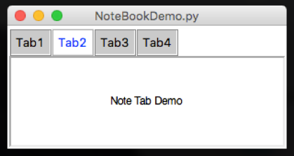
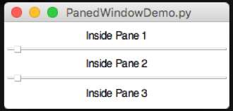
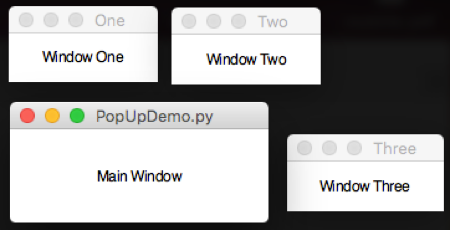

#Container Options
----
The standard way of using appJar, is simply to place all widgets into a simple window. Everything is grouped into that single window, and and changes affect everything in that window.

It's sometimes desirable to group widgets together within a window. A number of options are provided to make this easier.

###Label Frame
----
A way of grouping widgets into a box, with a label at the top of the box.  

* Position the *LabelFrame* within the grid, then position widgets inside the *LabelFrame*
* `.startLabelFrame(name)`  
* `.stopLabelFrame()`  
    Used to start and stop a labelFrame  
* `.setSticky(coords)`  
    Used to specify how widgets should be positioned inside the *LabelFrame*  
###NoteBook
---
A way to create a (basic) tabbed-style interface.  
  

* Position the *NoteBook* within the grid, start a *Tab*, then position widgets inside the *Tab*  
* `.startNoteBook(name)`  
* `.stopNoteBook()`  
    Used to start & stop the main *NoteBook*  
* `.startNoteTab(name)`
* `.stopNoteTab()`  
    Used to start and stop each of the tabs in the *NoteBook*.  
###PanedWindow
---
A way to arrange re-sizable frames, with drag-bars.  

* Call `.startPanedWindow(name)` to create the initial pane  
* Then keep calling it to add additional panes  
* Calling `.setPanedWindowVertical(name)` will change the layout to vertical, allowing more configurations.  
####Horizontal Panes
* Create an initial pane  
* Keep adding panes to the initial pane  
  
####Vertical Panes
* Create an initial pane  
* Make it vertical  
* Add a second pane  
* Keep adding panes to the inittial pane  
  
####E-Pane
* Create an initial pane  
* Add a second pane
* Make the second pane vertical  
* The remaining panes are added to frame 2  
  
####T-Pane
* Create an initial pane
* Make it vertical
* Add a second pane
* Add the remaining panes to pane 2  
  
###SubWindow
---
A way to add additional windows, which can be hidden and shown.  

* `.startSubwindow(name)`  
* `.stopSubwindow()`  
    Used to start and stop defining a *SubWindow*  
* `.showSubWindow(name)`  
* `.hideSubWindow(name)`  
    Used to show and hide the specified *SubWindow*  

#Containers Under Development
---

###Scroll Pane  
---
A scrollable frame, to contain widgets.

* `.startScrollPane(title)`  
* `.stopScrollPane(title)`  
