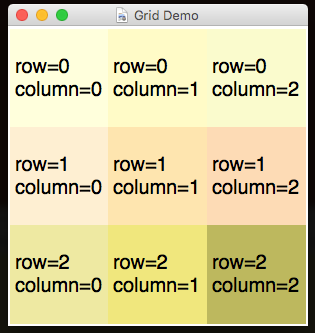
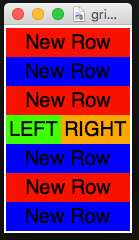

#Arranging Widgets
---

You can make your GUIs as simple or as complicated as you want...  

###Sequential Layout
---
By default, each time you add a widget to a GUI, it is simply added on a new row:  


```python
from appJar import gui  

def changeLabel(btn):  
    app.setLabel("l2", app.getEntry("text"))  

app = gui()  
app.addLabel("l1", "Simple Demo")
app.addEntry("text")
app.addButton("OK", changeLabel)
app.addEmptyLabel("l2")
app.go()
```

###Grid Layout
---
If, however, you want a bit more control, then you can treat your GUI like a **GRID**.  
Think of it just like a spreadsheet, and position your widgets in whichever cell you want.  

Each time you add a widget, simply specify the row and column it should appear in (always in that order):  


```python
from appJar import gui

app=gui("Grid Demo", "300x300")
app.setSticky("news")
app.setExpand("both")
app.setFont(20)

app.addLabel("l1", "row=0\ncolumn=0", 0, 0)
app.addLabel("l2", "row=0\ncolumn=1", 0, 1)
app.addLabel("l3", "row=0\ncolumn=2", 0, 2)
app.addLabel("l4", "row=1\ncolumn=0", 1, 0)
app.addLabel("l5", "row=1\ncolumn=1", 1, 1)
app.addLabel("l6", "row=1\ncolumn=2", 1, 2)
app.addLabel("l7", "row=2\ncolumn=0", 2, 0)
app.addLabel("l8", "row=2\ncolumn=1", 2, 1)
app.addLabel("l9", "row=2\ncolumn=2", 2, 2)

app.setLabelBg("l1", "LightYellow")
app.setLabelBg("l2", "LemonChiffon")
app.setLabelBg("l3", "LightGoldenRodYellow")
app.setLabelBg("l4", "PapayaWhip")
app.setLabelBg("l5", "Moccasin")
app.setLabelBg("l6", "PeachPuff")
app.setLabelBg("l7", "PaleGoldenRod")
app.setLabelBg("l8", "Khaki")
app.setLabelBg("l9", "DarkKhaki")

app.go()
```

If youre still not satisfied, you can configure widgets to span across multiple columns or rows.  
Simply provide a third & fourth parameter to specify how many rows and columns to span:  


```python
from appJar import gui

app=gui("Grid Demo", "300x300")
app.setSticky("news")
app.setExpand("both")
app.setFont(14)

app.addLabel("l1", "row=0\ncolumn=0")
app.addLabel("l2", "row=0\ncolumn=1\ncolspan=2", 0, 1, 2)
app.addLabel("l4", "row=1\ncolumn=0\ncolspan=2", 1, 0, 2)
app.addLabel("l6", "row=1\ncolumn=2\ncolspan=1\nrowspan=2", 1, 2, 1, 2)
app.addLabel("l7", "row=2\ncolumn=0", 2)
app.addLabel("l8", "row=2\ncolumn=1", 2, 1)

app.setLabelBg("l1", "red")
app.setLabelBg("l2", "blue")
app.setLabelBg("l4", "green")
app.setLabelBg("l6", "orange")
app.setLabelBg("l7", "yellow")

app.go()
```

Note, the parameters are read from left to right, so:  

* If you're spcifying a column, you must first specify a row  
* If you're specifying a row-span, you must first specify both the row & column  
* And, if you're specifying a column-span, you must first specify a row, column & column-span  

###Named Arguments

If this all seems a bit complicated, and you just want to add widgets sequentially, with only 1 row containing 2 widgets, you can take advantage of Python's support for *Named Arguments*.  

####Row Helpers

* `.getRow()` or `.gr()`  
    Returns the row number currently being used.  
    Useful if you're mainly adding things sequentially, but want to modify one line out of sequence.  



```python
from appJar import gui

colours=["red","blue"]

app=gui()

for loop in range(3):
    app.addLabel(loop, "New Row", colspan=2)
    app.setLabelBg(loop, colours[loop%2])

row = app.getRow() # get current row

app.addLabel("a", "LEFT", row, 0) 
app.addLabel("b", "RIGHT", row, 1) 

app.setLabelBg("a", "green")
app.setLabelBg("b", "orange")

for loop in range(3, 6):
    app.addLabel(loop, "New Row", colspan=2)
    app.setLabelBg(loop, colours[loop%2])

app.go()
```
