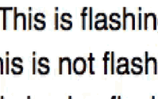
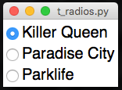
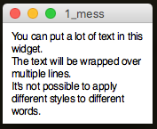
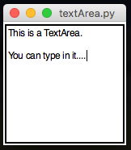
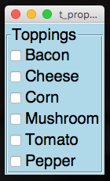
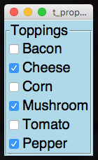
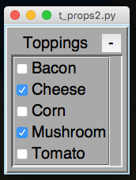
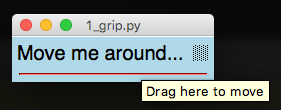

#Widgets
----
In a GUI, the fillings are known as **widgets**.  
There are lots of different widgets to chose from, each suited to a specific task.  

Nearly every widget needs a **TITLE**.  
This is a unique name for the widget, so that later you can get information from that widget, or change it.  

Nearly all widgets in appJar provide the same three functions:

* (Always) - **ADD** a widget (with a unique title) - this creates the widget
* (Often) - **GET** the widget (using its unique title) - this gets the contents of the widget (usually done in a function)
* (Sometimes) - **SET** the widget (using its unique title) - this changes what's in the widget

On top of these, there is a common set of functions for [changing widgets](pythonWidgetOptions.md).  
As well as some specialist functions, unique to each widget (see below).  

##Label
---
*Labels* are used for displaying text in the GUI.  

* They are great for titles, at the top of the GUI, usually spanning multiple columns.  
* They are really useful before *Entries* and *Drop-downs* to explain their purpose.  
* And, they're very helpful at the bottom of the GUI, to show the results of an action.  
  
```python
from appJar import gui

app = gui()

app.addLabel("l1", "Label 1")
app.addLabel("l2", "Label 2")
app.addLabel("l3", "Label 3")
app.addLabel("l4", "Label 4")
# common set functions
app.setLabelBg("l1", "red")
app.setLabelBg("l2", "yellow")
app.setLabelBg("l3", "purple")
app.setLabelBg("l4", "orange")

app.go()
```

####Add Labels
* `.addLabel(title, text=None)`  
    As with all widgets, when you add a *label*, a title must be provided - to identify the *label*. This is then followed by an optional piece of text to display.

* `.addEmptyLabel(title)`  
    Does the same as add a *label*, except there''s no parameter to set any text.

* `.addFlashLabel(title, text=None)`  
    This adds a flashing *label*, that will alternate between the foreground and background colours.

  
```python
from appJar import gui

app = gui()

app.addFlashLabel("f1", "This is flashing")
app.addLabel("f2", "This is not flashing")
app.addFlashLabel("f3", "This is also flashing")

app.go()
```

####Set Labels
* `.setLabel(title, text)`  
    Change the contents of the *label*.

* `.clearLabel(title)`  
    Clear the contents of the *label*.

####Get Labels
* `.getLabel(title)`  
    Get the contents of the *label*.

##Auto-Labelled Widgets
___

It's possible to automatically include a *label* alongside some widgets.  
Both the label and widget will be placed in the same grid space.  
Simply add the word `Label` to the command when adding the widget:  

* `.addLabelEntry(title)`
* `.addLabelNumericEntry(title)`
* `.addLabelSecretEntry(title)`
* `.addLabelScale(title)`
* `.addLabelOptionBox(title, values)`
* `.addLabelTickOptionBox(title, values)`
* `.addLabelSpinBox(title, values)`
* `.addLabelSpinBoxRange(title, from, to)`  

See the relevant section for a description of what the widget does.

##Entry
____
Entries are used to capture input from the user. They take a single parameter - a title.

There are three special-case entries:

* NumericEntry - this only allows numbers to be typed in - always returns a float.
* SecretEntry - this will show stars, instead of the letters typed - useful for capturing passwords.
* AutoEntry - this takes a list of words to provide auto-completion.  


```python
from appJar import gui

app=gui()

app.addEntry("e1")
app.addEntry("e2")
app.addEntry("e3")
app.addLabelEntry("Name")

app.setEntryDefault("e2", "Age here")

app.go()
```

####Add Entries

* `.addEntry(title)`
* `.addNumericEntry(title)`
* `.addSecretEntry(title)`
* `.addAutoEntry(title, words)`  

    Each of these will add the specified type of Entry, using the title provided.

#### Set Entries
* `.setEntry(title, text)`  
    This sets the contents of the specified entry box.

* `.setEntryDefault(title, text)`  
    This sets a default value to display in an entry box.  
    Once the user starts typing, it will disappear.  
    The text is centered, shown in a light gray font, and will not be returned by `.getEntry(title)`  

* `.clearEntry(title)`  
    This will clear the contents of the specified entry box.

* `.clearAllEntries()`  
    This will clear all the entry boxes in the GUI.

* `.setFocus(title)`  
    This will put the cursor in the specified entry box, so that the user can start typing without needing to click.

#### Get Entries
* `.getEntry(title)`  
    This will return the contents of the specified entry box.  
    NB. *numericEntries* always return a float.  

##Button
____
A clickable button, that will call a function.  
These are the key to starting an interactive application.  
The GUI is looping, waiting for something to happen.  
A button click is the classic way to start interacting with a GUI.

Whenever any function is called by the GUI, the title of the widget that called it is passed as a parameter.  
That way, multiple widgets can use the same function, but different actions can be performed, depending on the name passed as a parameter.


```python
    from appJar import gui

    # the title of the button will be received as a parameter
    def press(btn):
        print(btn)

    app=gui()
    # 3 buttons, each calling the same function
    app.addButton("One", press)
    app.addButton("Two", press)
    app.addButton("Three", press)
    app.go()
```

####Add Buttons

* `.addButton(title, function)`  
    Add a single button to the GUI, the text on the button will be the same as the button's title.  
    A function should be specified, which will be called when the button is clicked.

* `.addButtons(titles, functions)`  
    It's possible to add a list of buttons to the GUI.  
    Pass a 1-dimensional or 2-dimensional list, and they will be rendered accordingly.  
    A single function can be passed, to use for all buttons.  
    Or a list of functions can be passed, which MUST correspond to the buttons.  

* `.addNamedButton(name, title, function)`  
    By default, it's not possible to have two buttons with the same text.  
    If that's required, a named button should be used.  
    This allows a name and title to be set for a button.  
    The name will be displayed on the button, and the title passed to the function.

####Set Buttons
* `.setButton(name, text)`  
    This will change the text displayed on a button, but **NOT** the value passed as a parameter to the function.  

* `.setButtonImage(title, image)`  
    This allows an image to be placed on a button, instead of the usual text.  

##RadioButton
____
A group of round boxes, only one of which can be selected.  
These are great for getting a single value, for a multiple choice question.  

  

```python
from appJar import gui

app=gui()
app.addRadioButton("song", "Killer Queen")
app.addRadioButton("song", "Paradise City")
app.addRadioButton("song", "Parklife")
app.go()
```

####Add RadioButtons
* `.addRadioButton(title, name)`  
    This will create a RadioButton grouped by the specified title.  
    This button will have the value of name.  
    Radio buttons are usually used in groups.  

####Set RadioButtons
* `.setRadioButton(title, value)`  
    This will tick the specified RadioButton.  

* `.setRadioTick(title, tick=True)`  
    It is possible to use tick-boxes instead of the classic circular radio-button.  
    Setting tick to True will convert all the radio-buttons for this title to tick boxes.  

####Get RadioButtons
* `.getRadioButton(title)`  
    Gets the value of the selected RadioButton, for the specified title.
```python
    from appJar import gui

    def press(rb):
        print(app.getRadioButton("song"))

    app=gui()
    app.addRadioButton("song", "Killer Queen")
    app.addRadioButton("song", "Paradise City")

    # call this function, when the RadioButton changes
    app.setRadioButtonFunction("song", press)

    app.addButton("PLAY", press)
    app.go()
```

##CheckBox
____
A simple tick-box, with a label, that can be either ON or OFF.  

  

```python
from appJar import gui

app=gui()
app.setFont(20)

app.addCheckBox("Apples")
app.addCheckBox("Pears")
app.addCheckBox("Oranges")
app.addCheckBox("Kiwis")

app.setCheckBox("Oranges")

app.go()
```

####Add CheckBoxes
* `.addCheckBox(title)`  
    This creates a CheckBox, with the specified title.  

####Set CheckBoxes
* `.setCheckBox(title, ticked=True)`  
    This will tick the CheckBox, or untick it if ticked is set to False.  

####Get CheckBoxes
* `.getCheckBox(title)`  
    This will return True or False, depending on the state of the CheckBox.  

##OptionBox
____
Creates a simple drop-down box.  
It is only possible to select one option from this drop-down.  
Pass in a list of values to show in the drop-down box.  
They will be added in the same order, with the first item shown.  
If the first item is empty, a simple title `- options -` will be created.  
Any other empty items will be removed.  
If an item starts with a dash (-), it will be treated as a separator, and can't be selected.  

   

```python
from appJar import gui

app=gui()
app.setFont(20)
app.addLabelOptionBox("Options", ["- Fruits -", "Apple", "Orange",
                        "Pear", "kiwi", "- Pets -", "Dogs", "Cats",
                        "Fish", "Hamsters"])
app.go()
```

####Add OptionBoxes
* `.addOptionBox(title, values)`  
    This will create an OptionBox, adding the contents of the values list, in the order specified.  

* `.addTickOptionBox(title, values)`  
    This will create an OptionBox made up of check buttons.  
    The `title` will always be displayed as the *selected* entry in the OptionBox, event though it can't be selected/ticked.  
    Instead of selecting a single item, you tick the ones you want.  
    Calling `.getOptionBox(title)` will return a dictionary of the options along with a True/False value.  
      

```python
from appJar import gui

def get(btn):
    print(app.getOptionBox("Favourite Pets"))

app=gui()
app.setFont(20)
app.addTickOptionBox("Favourite Pets", ["Dogs", "Cats", "Hamsters", "Fish"])
app.addButton("GET", get)
app.go()
```

####Set OptionBoxes
* `.changeOptionBox(title, newOptions, index)`  
    This will replace the contents of the OptionBox, with the new list provided.  
    If specified, the indexed item will be selected - this can be a position or an item name.  
    If setting a TickOptionBox, pass in the optional value.  

* `.setOptionBox(title, position, value=True)`  
    This will select the item in the list, at the position specified.  
    Alternatively, the name of an item can be specified.  
    If changing a TickOptionBox, the specified item will be set to the specified value.  

* `.deleteOptionBox(title, position)`  
    This will delete the item in the list, at the position specified.  
    Alternatively, the name of an item can be specified.  
    Not available on TickOptionBoxes.  

####Get OptionBoxes
* `.getOptionBox(title)`  
    This will return the currently displayed value in an OptionBox.  
    Or a dictionary of names, and their boolean value if a TickOptionBox.  
    Will return None, if an invalid option is currently selected.  

##SpinBox
____
A scrollable list of options. Up and down buttons are provided to scroll from one item to the next.  
Unlike the OptionBox, you do not get a drop-down of choices, instead it spins to the next/previous option.  

  

```python
from appJar import gui

app=gui()
app.setFont(20)
app.addLabelSpinBox("options", ["Apple", "Orange", "Pear", "kiwi"])
app.go()
```

####Add SpinBoxes
* `.addSpinBox(title, values)`  
    This will create a SpinBox, adding the contents of the values list, in the order specified.

* `.addSpinBoxRange(title, from, to)`  
    This will create a SpinBox, with a numeric range of items.  

      

```python
    from appJar import gui

    app=gui()
    app.setFont(20)
    app.addSpinBoxRange("Numbers", 1, 12)
    app.go()
```

####Set SpinBoxes
* `.setSpinBox(title, value)`  
    This will select the specified value in the SpinBox.  

* `.setSpinBoxPos(title, pos)`  
    This will select the value at the specified position in the SpinBox.  

####Get SpinBoxes
* `.getSpinBox(title)`  
    This will get the selected value from the specified SpinBox.  

##ListBox
____
A box containing a list of items, single or multi-select

  

```python
from appJar import gui

app=gui()
app.setFont(20)
app.addListBox("list", ["apple", "orange", "pear", "kiwi"])
app.go()
```

####Add ListBoxes
* `.addListBox(title, values)`  
    Creates a ListBox with the specified values.  

* `.addListItem(title, item)`  
    Adds a single item to the the end of the ListBox, and selects it.  

* `.addListItems(title, items)`  
    Adds a list of items to the end of the List Box, selecting the last one.  

####Set ListBoxes
* `.updateListItems(title, items)`  
    Replace the contents of the specified ListBox with the new values.  

* `.removeListItem(title, item)`  
    Remove the specified item from the  specified ListBox.  

```python
from appJar import gui
def press(btn):
    items = app.getListItems("list")
    if len(items)> 0:
        app.removeListItem("list", items[0])

app=gui()
app.setFont(20)
app.addListBox("list", ["apple", "orange", "pear", "kiwi"])
app.addButton("press",  press)
app.go()
```

* `.clearListBox(title)`  
    Removes all items from the specified ListBox.  

* `.setListBoxRows(title)`  
    Sets how many rows to display in the specified ListBox.  

* `.setListBoxMulti(list, multi=True)`  
    Configures whether the specified ListBox is single or multi select.  

* `.selectListItem(title, item)`  
    Selects the specified item in the specified ListBox.  

* `.setListItemBg(title, item, colour)` & `.setListItemFg(title, item, colour)`  
    `.setListItemAtPosBg(title, item, colour)` & `.setListItemAtPosFg(title, item, colour)`  
    Sets the background or foreground colours the specified ListBox item.  
    Can either specify a named item (will update all with that name) or the position of an item.  

####Get ListBoxes
* `.getListItems(title)`  
    Gets all of the selected items from the specified ListBox.  

* `.getAllListItems(title)`  
    Gets all of the items from the specified ListBox.  

##Scale
____
A slider, that has a minimum & maximum value.  

  

```python
from appJar import gui

app=gui()
app.setFont(20)
app.addLabelScale("scale")
app.go()
```

####Add Scales
* `.addScale(title)`  
    Adds a horizontal scale, with a default range between 0 and 100.  

####Set Scales
* `.setScale(title, pos)`  
    Sets the selected pos for the specified Scale.  

* `.setScaleRange(title from, to, curr=None)`  
    Allows you to change the range available in the Scale.  
    If ```curr``` is provided, then the Scale will be set to that value.  

* `.showScaleIntervals(title, intervals)`  
    Configures the Scale to show interval labels along its length.  
      

* `.showScaleValue(title, show=True)`  
    Configures the Scale to show the currently selected value.  
      

* `.setScaleHorizontal(title)` & `.setScaleVertical(title)`  
    Changes the Scale's orientation to the specified value.  

      

* `.setScaleWidth(title, width)` & `.setScaleLength(title, length)`  
    Sets a width/length for the scale's slider.  

* `.setScaleFunction(title, func)`  
    Sets a function to call, each time the scale is changed.  
    The function must take one parameter, which will be populated with the scale's title.  

####Get Scales
* `.getScale(title)`  
    Gets the currently selected value from the scale.  

##Message
____
Similar to a Label, except it will wrap the text over multiple lines.  

  

```python
from appJar import gui

app=gui()
app.setFont(12)
app.addMessage("mess", """You can put a lot of text in this widget.
The text will be wrapped over multiple lines.
It's not possible to apply different styles to different words.""")
app.go()
```

####Add Messages
* `.addMessage(title, text)`  
    Adds a Message widget, with the specified text.  

* `.addEmptyMessage(title)`  
    Adds an empty Message widget.  

####Set Messages
* `.clearMessage(title)`  
    Clears the specified Message widget.  

* `.setMessage(title, text)`  
    Sets the contents of the specified Message widget, to the specified text.  

##TextArea
____
Similar to an Entry box, but allows you to type text over multiple lines.  

  

```python
from appJar import gui

app=gui()
app.addTextArea("t1")
app.go()
```

####Add TextAreas
* `.addTextArea(title)`  
    Adds an empty TextArea, with the specified title.  

* `.addScrolledTextArea(title)`  
    Adds a scrollable TextArea with the specified title.  

  

####Set TextAreas
* `.setTextArea(title, text)`  
    Changes the contents of the specified TextArea, to the specified text.  

* `.clearTextArea(title)`  
    Clears the contents of the specified TextArea.  

####Get TextAreas
* `.getTextArea(title)`  
    Gets the contents of the specified TextArea.  

##Meter  
____
Various styles of progress meter:  

* #### Meter  

      
    A simple meter for showing progress from 0% to 100%.  

* #### SplitMeter  

      
    A possesion style meter, showing percentages on either side.  

* #### DualMeter  

      
    Two separate meters, expanding out from the middle.  

```python
from appJar import gui

app=gui()
app.addMeter("progress")
app.setMeterFill("progress", "blue")
app.go()
```

####Add Meters
* `addMeter(name)` & `.addSplitMeter(name)` &  `.addDualMeter(name)`  
    Adds a meter with the specified name, of the specified type..  
####Set Meters
* `setMeter(name, value, text=None)`  
    Changes the specified meter to the specified value.  
    For `Meter` & `SplitMeter`should be a value between 0 and 100.  
    For `DualMeter` should be a list of two values, each between 0 and 100.  

* `setMeterFill(name, colour)`  
    Changes the fill colour of the specified meter.  
    For `SplitMeter` & `DualMeter`should be a list of two colours.  

####Get Meters
* `getMeter(name)`  
    Gets the value of the specified meter.  
    As meters convert their data to a value between 0 and 1, this will return a list of two values: `(0.45, '45 %')`  

####Background Processing  
Meters are designed to show progress over time.  
One common solution is to register a function that is constantly updating a meter.  
This should then be monitoring/updating a global variable:  

```python
def updateMeter():
    app.setMeter("progress", percentComplete)

# schedue function to be called regularly
app.registerEvent(updateMeter)
```

##Properties
____
A compound widget that shows multiple CheckButtons linked to a dictionary.  
Note, dictionaries have no order, so when added as a dictionary, the items will be automatically sorted.  




```python
from appJar import gui

toppings={"Cheese":False, "Tomato":False, "Bacon":False,
            "Corn":False, "Mushroom":False}

app=gui()
app.setBg("lightBlue")
app.setFont(20)
app.addProperties("Toppings", toppings)
app.setProperty("Toppings", "Pepper")
app.go()
```

####Add Properties
* `addProperties(title, values)`  
    Creates a new Properties widget, with the specified title.  
    If values is populated, then the dictionary items will be added to the widget.  

####Set Properties
* `setProperties(title, props)`  
    Adds the dictionary of properties to the widget.  
    If any of them already exist, they will be updated.  

* `setProperty(title, prop, value=False)`  
    Sets the named property to the specified value.  
    If it doesn't exist, it will be added first, at the end of the widget.  

* `deleteProperty(title, prop)`  
    Deletes the named property from the widget.  

####Get Properties
* `getProperties(title)`  
    Gets a dictionary of the all items in the Properties widget.  

* `getProperty(title, prop)`  
    Gets the value of the named property.  

####Examples
It's possible to put Properties into ToggleFrames, and also set a Function to listen for any changes.  




```python
from appJar import gui

def changed(props):
    print("Changed", props)

toppings={"Cheese":False, "Tomato":False, "Bacon":False,
            "Corn":False, "Mushroom":False}

app=gui()
app.setBg("lightBlue")
app.setFont(20)

app.startToggleFrame("Toppings")
app.addProperties("Toppings", toppings)
app.setPropertiesFunction("Toppings", changed)
app.stopToggleFrame()

app.go()
```

##Separator
____
Useful for indicating separation between widgets.  
Will draw a horizontal/vertical line spanning the cell.  
  

```python
from appJar import gui

app=gui()
app.setBg("lightBlue")
app.addHorizontalSeparator(0,0,4, colour="red")
app.addVerticalSeparator(1,0, colour="red")
app.addVerticalSeparator(1,1, colour="red")
app.addVerticalSeparator(1,2, colour="red")
app.addVerticalSeparator(1,3, colour="red")
app.addHorizontalSeparator(2,0,4, colour="red")
app.go()
```

####Add Seperators

* `.addHorizontalSeparator(colour=None)` & `.addVerticalSeparator(colour=None)`  
    Adds a separator (a horizontal or vertical line) spanning the cell.  
    An optional colour can be passed in, to set a colour for the separator.  

##Link/WebLink
____
Clickable text to call a function or launch a URL

  

```python
from appJar import gui
def press(link):
    app.infoBox("Info", "You clicked the link!")

app=gui()
app.setFont(20)
app.addLink("Click me", press)
app.addWebLink("appJar.info", "http://appJar.info")
app.go()
```

####Add Links

* `.addLink(title, func)`  
    Adds a **hyperlink**, that when clicked, will call the specified function.  

* `.addWebLink(title, page)`  
    Adds a **hyperlink**, that when clicked, will launch the default browser, and load the specified page.  
    It must be a fully formed link, including ```http://```  

##Grip
____
Clickable icon to drag the window around.  

  

```python
from appJar import gui

app=gui()
app.setFont(20)
app.setBg("lightBlue")

app.addLabel("l1", "Move me around...", 0, 0)
app.addGrip(0,1)
app.addSeparator(1,0,2, colour="red")
app.go()
```
####Add Grips

* `.addGrip()`  
    Adds a simple grip icon.  
    The mouse pointer changes over the grip, and a ToolTip will be shown.  
    The size and image can't be changed.  

##DatePicker
---
A widget to capture a date - will handle presenting accurate drop-downs, and return a date.  
  

```python
from appJar import gui

def showDate(btn):
    print(app.getDatePicker("dp"))

    app=gui()
    app.addDatePicker("dp")
    app.addButton("GET", showDate)
    app.setDatePickerRange("dp", 1900, 2100)
    app.setDatePicker("dp")
    app.go()
```
####Add DatePickers  

* `.addDatePicker(title)`  
    Create a DatePicker, with a range from 1/1/1970 to 31/12/2020  

####Set DatePickers  

* `.setDatePicker(title, date=None)`  
    Will set the specified DatePicker to the specified date, or current date if no date is supplied.  

* `.setDatePickerRange(title, startYear, endYear=None)`  
    Set the range for the named DatePicker.  
    If endYear is None, the current Year will be used.  

####Get DatePickers  

* `.getDatePicker(title)`  
    Will return the currently selected date.  
