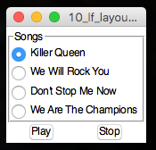

# Grouping Widgets
Once you have got to grips with laying out your widgets, it is possible to group them together.
Three main styles are currently supported:

##LabelFrame
Will put a border around the widgets, with a title

* .`startLabelFrame(title)`
* .`stopLabelFrame()`
* .`setLabelFrameAnchor(title, anchor)`

##NoteBook
Will create a tabbed interface, with a number of pages

* .`startNoteBook(note)`
* .`startNoteTab(tab)`
* .`stopNoteTab()`
* .`stopNoteBook()`
* .`setNoteTab(note, tab)`
* .`setNoteBookBg(note, active, inactive)`
* .`setNoteBookFg(note, active, inactive)`
* .`setNoteTabBg(note, tab, bg)`

##PanedWindow
Will create a split view, with draggable panes

* .`startPanedWindow(title)`
* .`stopPanedFrame()`
* .`setPanedWindowVertical(title)`

##SubWindow
Allows the creation of additional windows.
The window is hidden until `.showSubWindow(title)` is called.

* .`startSubWindow(name, title=None)`
* .`stopSubWindow()`
* .`showSubWindow(title)`
* .`hideSubWindow(title)`
* .`destroySubWindow(title)`
