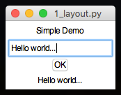
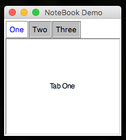

##Simple Layout
Laying out widgets is very simple.

By default, each new widget is simply added on a new line. That way, you can very quickly, create a simple app.

For example:

```python
from rwbatools import gui  

def changeLabel(btn):  
    app.setLabel("l2", app.getEntry("text"))  

app = gui()  
app.addLabel("l1", "Simple Demo")
app.addEntry("text")
app.addButton("OK", changeLabel)
app.addEmptyLabel("l2")
app.go()
```


## Grid Layout
If, however, you want more than that, then a grid layout is supported.
Each time you add a widget, you can specify a column, row, and even a column-span to position it in.


## Grouping Widgets
Once you have got to grips with laying out your widgets, it is possible to group them together.
Three main styles are currently supported:

###LabelFrame
Will put a border around the widgets, with a title

* .`startLabelFrame(title)`
* .`stopLabelFrame()`
* .`setLabelFrameAnchor(title, anchor)`


###NoteBook
Will create a tabbed interface, with a number of pages

* .`startNoteBook(note)`
* .`startNoteTab(tab)`
* .`stopNoteTab()`
* .`stopNoteBook()`
* .`setNoteTab(note, tab)`
* .`setNoteBookBg(note, active, inactive)`
* .`setNoteBookFg(note, active, inactive)`
* .`setNoteTabBg(note, tab, bg)`



###PanedWindow
Will create a split view, with draggable panes

* .`startPanedWindow(title)`
* .`stopPanedFrame()`
* .`setPanedWindowVertical(title)`

###SubWindow
Allows the creation of additional windows.
The window is hidden until `.showSubWindow(title)` is called.

* .`startSubWindow(name, title=None)`
* .`stopSubWindow()`
* .`showSubWindow(title)`
* .`hideSubWindow(title)`
* .`destroySubWindow(title)`
